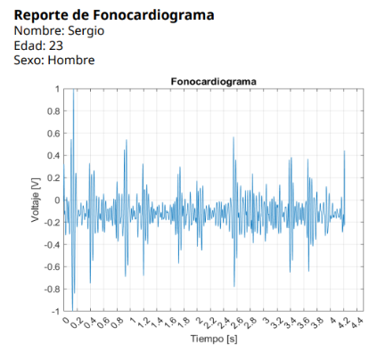

# Electronic Stethoscope

**D. Larissa Luna González**, Sergio A. García García

**Biomedical Physics Congress 2024**

**Format:** Oral presentation  

**Presented:** 7/07/2024  

In this project, an **electronic stethoscope** focused on heart auscultation for the identification of the **S1 and S2 sounds of the cardiac cycle** was implemented. Signal conditioning was performed on the signal, obtained by using a capacitive microphone attached to a stethoscope bell, through stages of **pre-amplification, filtering, and the implementation of an adder**. The analog-to-digital conversion of the signal was carried out using the **ESP32 DEVKIT microcontroller**. In the Matlab development environment, the signal was digitally processed to obtain a phonocardiogram signal after a digital filtering stage. Based on the phonocardiogram signal, it was possible to generate an **audio file** and listen to the heart sounds. Finally, a graphical interface was designed to display these results and save the audio in a WAV file, as well as to generate a **PDF document** that shows the phonocardiogram along with other patient data.

